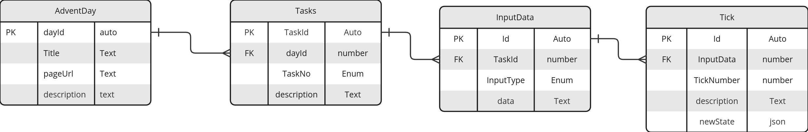

# Advent of Code GraphQL server
 

This document outlines the technical design for setting up a Django project with GraphQL integration. It covers the initial setup, database design, GraphQL integration, authentication, performance optimization, testing, deployment, and monitoring.

## 1. Project Setup

### Environment Setup
- Use `virtualenv` or `pipenv` for creating and managing a virtual environment.

### Install Django
- Run `pip install django` to install Django.

### Create Django Project
- Initialize the project with `django-admin startproject djangoProject`.

### Install GraphQL Libraries
- Install Graphene-Django using `pip install graphene-django`.
- Add `graphene_django` to `INSTALLED_APPS` in `settings.py`.
- Add `GRAPHENE` configuration to `settings.py`.
- Create a Django App for Advent of Code:
- Run `python manage.py startapp adventofcode`.
 

## 2. UseCases
## 2. Usecases

This section outlines specific use cases for a Django GraphQL project designed to interact with an "Advent of Code" type task system. The system is envisioned to provide real-time feedback and states through GraphQL API calls, enhancing the user experience by offering immediate insights into task progress, specific tick states, and range-based state queries.

### Usecase 1: Get Number of Ticks to Complete Task

- **Overview**: This use case aims to provide users with the total number of ticks (or steps) required to complete a given "Advent of Code" task.
- **GraphQL Application**:
  - **Query**: Implement a GraphQL query that returns the total count of ticks necessary for completing the task.
  - **Purpose**: Helps users understand the scope of a task and plan their approach.

### Usecase 2: Return State for Tick 'n'

- **Overview**: Offers a detailed view of the task's state at a specific tick (or step), allowing users to inspect the progress or result at that exact point.
- **GraphQL Application**:
  - **Query**: Design a query that accepts a tick number 'n' as an argument and returns the state of the task at that tick.
  - **Purpose**: Enables users to debug or analyze the task's behavior at specific intervals, useful for educational purposes or optimization efforts.

### Usecase 3: Return States for Ticks 'n..m'

- **Overview**: Extends the functionality of the previous use case by allowing users to query the state of the task across a range of ticks, from 'n' to 'm'.
- **GraphQL Application**:
  - **Query**: Create a query that takes two arguments, 'n' (start tick) and 'm' (end tick), and returns the states of the task for all ticks in the specified range.
  - **Purpose**: Provides a comprehensive overview of the task's progression over time, aiding in thorough analysis, pattern identification, and educational demonstrations.
  
Each of these use cases leverages the strengths of GraphQL, such as fetching precise data with single API calls and minimizing over-fetching, to enhance the user experience in interacting with complex, stateful tasks like those found in "Advent of Code."

### Usecase 4: Calculate All Ticks for a Given Task Description

- **Overview**: This use case is designed to calculate and return all the ticks (or steps) required to complete an "Advent of Code" task based on a textual description of the task. It focuses on parsing and understanding the task requirements from a supplied text parameter and then calculating the sequence of steps needed to complete the task.
- **GraphQL Application**:
  - **Mutation**: Although traditionally queries are used for fetching data and mutations for modifying data, in this context, a mutation might be appropriate given the potentially complex and state-changing nature of calculating task steps based on textual analysis.
  - **Parameters**: The main input for this operation is a `taskDescription` text parameter that contains the description or rules of the task.
  - **Functionality**: The system analyzes the provided `taskDescription`, parses the requirements, and then computes the ticks or steps necessary to complete the task. This could involve algorithmic processing, natural language understanding, or a combination of predefined task templates and AI-driven analysis.
  - **Return**: Outputs the calculated series of ticks, possibly along with intermediate states or a summary of the steps involved in task completion.
  - **Purpose**: Allows users to input custom tasks described in natural language and receive a detailed, step-by-step breakdown of the actions required to complete these tasks. This can be particularly useful for educational purposes, algorithmic learning, and enhancing the interactive experience of coding challenge platforms.

By incorporating this use case, the GraphQL API extends its functionality to not only interact with predefined tasks but also to engage dynamically with user-generated content, showcasing the flexibility and power of GraphQL in handling complex computational and analytical tasks.

### View ER model

## 3. Database Design

### Define Models
- Create models in `models.py` according to your data structure.

### Database Migrations
- Use Django's built-in migration system (`makemigrations` and `migrate`).

### Admin Interface
- Optionally, register models in `admin.py` for admin panel access.

## 3. Integrating GraphQL

### Schema Definition
- Define your GraphQL schema in a `schema.py` file using Graphene-Django.

#### Types
- Mirror your Django models in GraphQL types.

#### Queries
- Implement queries for data retrieval.

#### Mutations
- Create mutations for CRUD operations.

### GraphQL View
- Setup a GraphQL endpoint in `urls.py` using `GraphQLView` from Graphene-Django.

## 4. Authentication and Authorization

### Django's Authentication System
- Utilize Django’s authentication for managing users.

### GraphQL Authentication
- Implement token authentication for GraphQL queries and mutations.

### Permissions
- Define permissions to restrict query and mutation access based on user roles.

## 5. Performance Optimization

### Query Optimization
- Optimize database queries using `select_related` and `prefetch_related`.

### Batching and Caching
- Implement DataLoader for batching and caching to improve performance.

## 6. Testing and Documentation

### Unit Tests
- Write tests for models, queries, and mutations.

### Integration Tests
- Ensure all parts of the application work together as expected.

### Documentation
- Document your API using GraphiQL or custom documentation tools.

## 7. Deployment

### Deployment Options
- Choose a suitable platform (Heroku, AWS, GCP).

### Static Files
- Configure handling of static files for production.

### Secure Deployment
- Ensure SSL/TLS setup and database security.

## 8. Monitoring and Logging

### Monitoring Tools
- Integrate tools like Sentry or New Relic for performance and error tracking.

### Logging
- Set up logging for effective debugging and monitoring.

This outline serves as a foundation for developing a Django project with GraphQL. It's crucial to adapt and expand upon this skeleton based on the specific requirements and challenges of your project.
